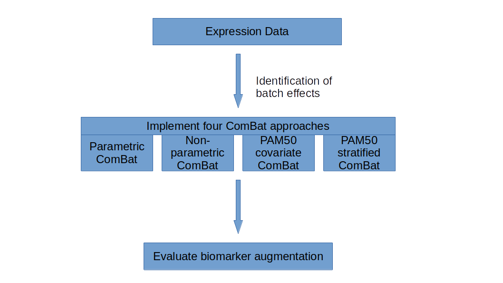
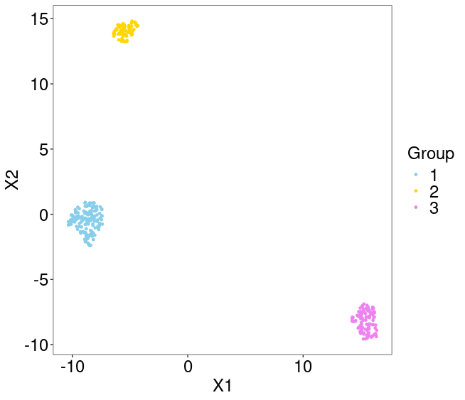
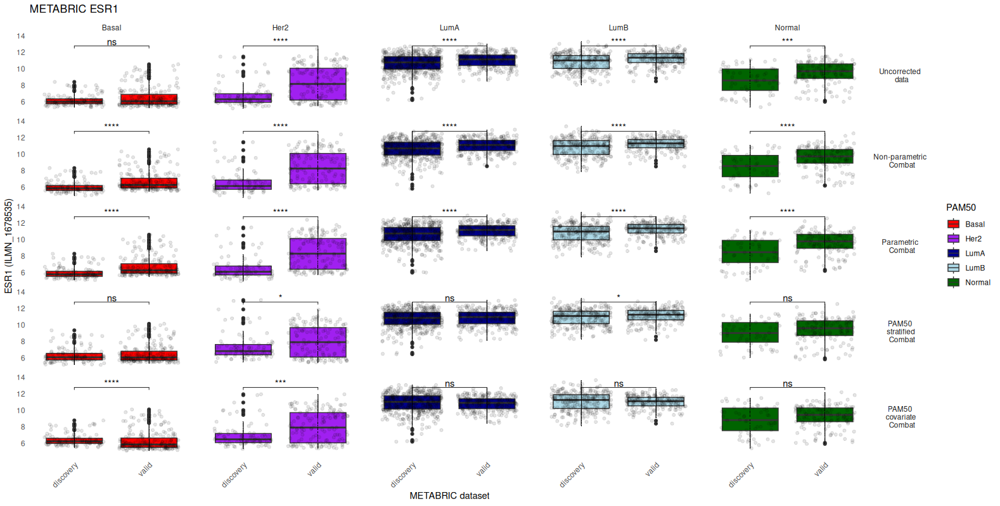
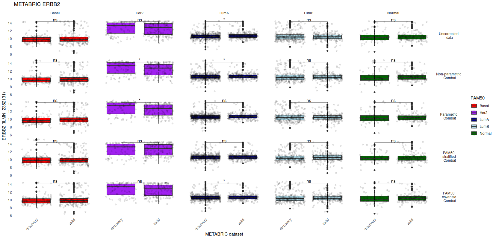
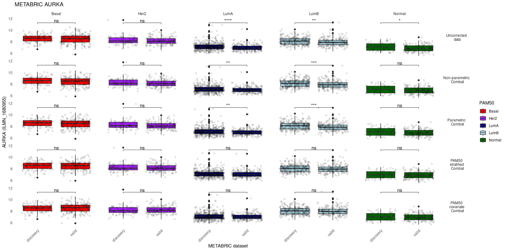
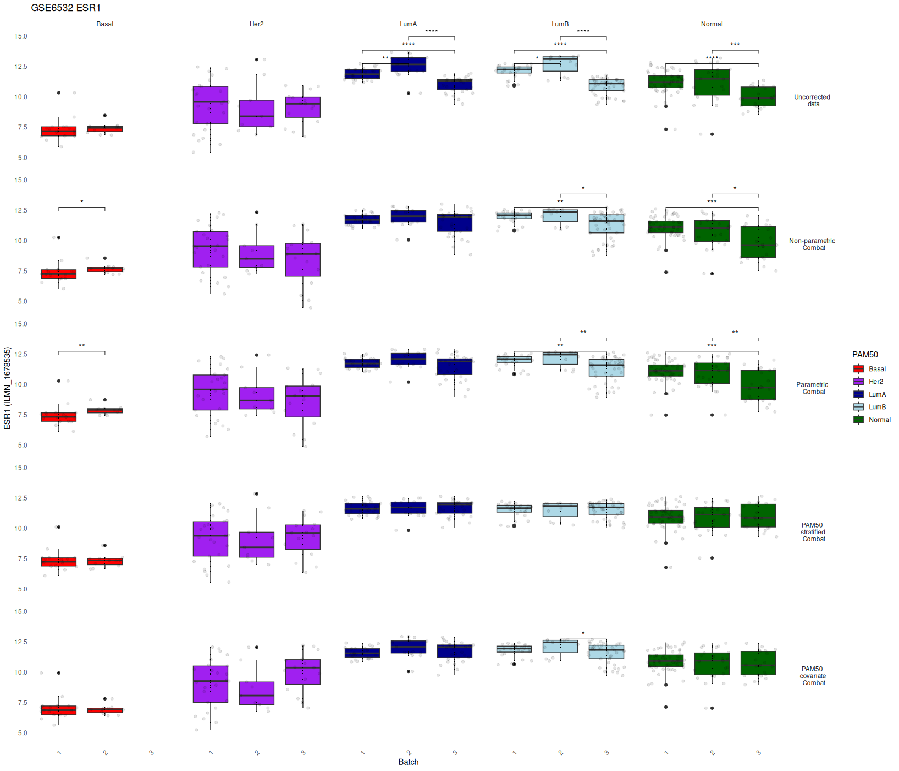
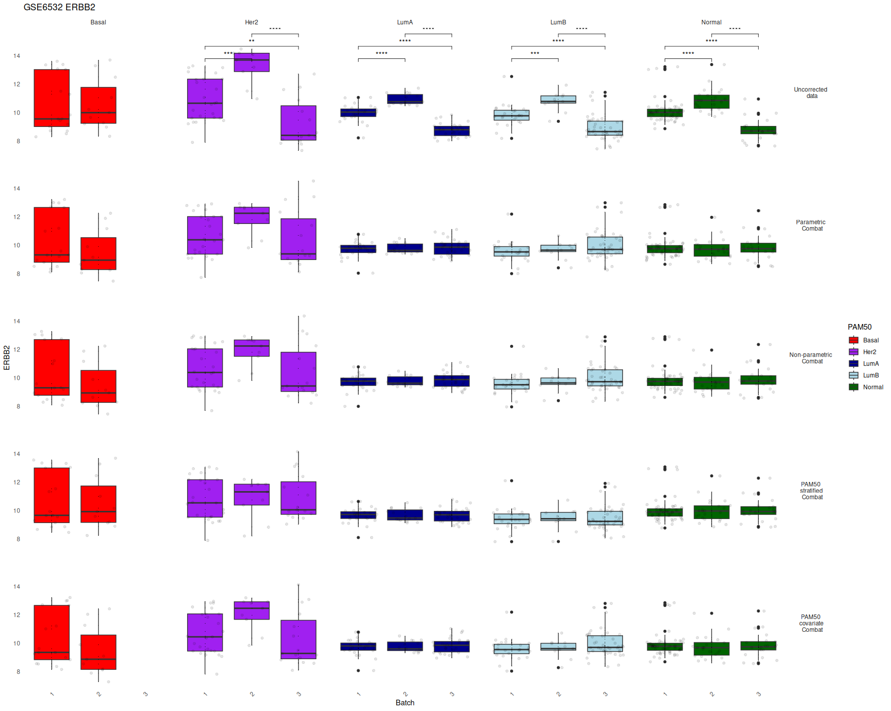
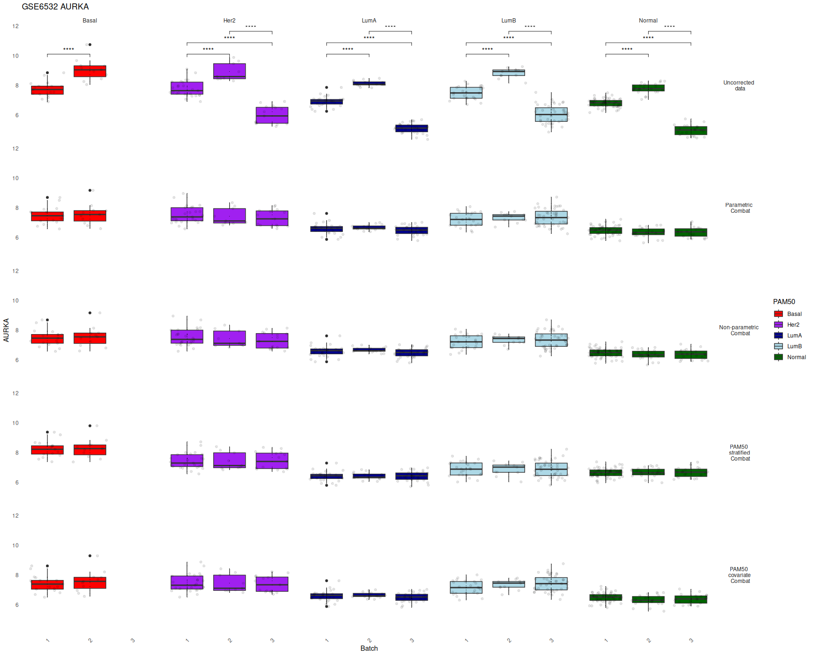
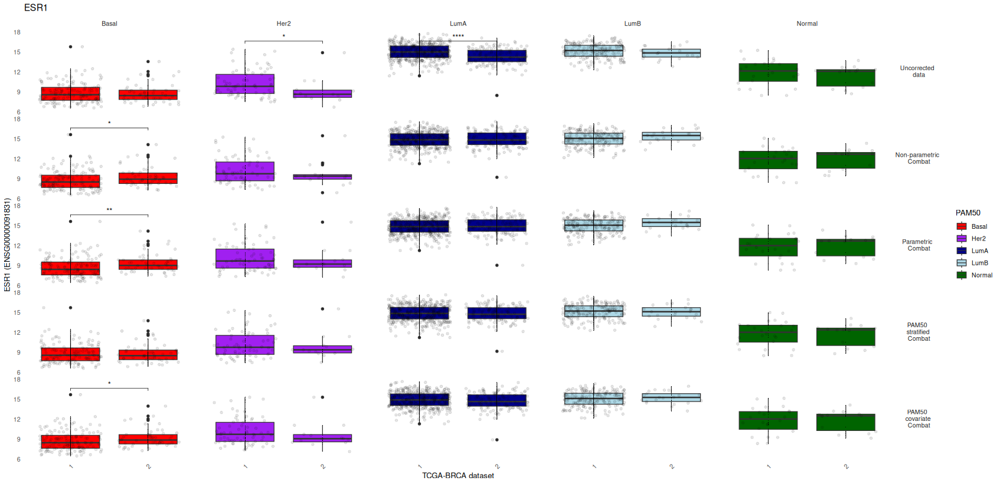
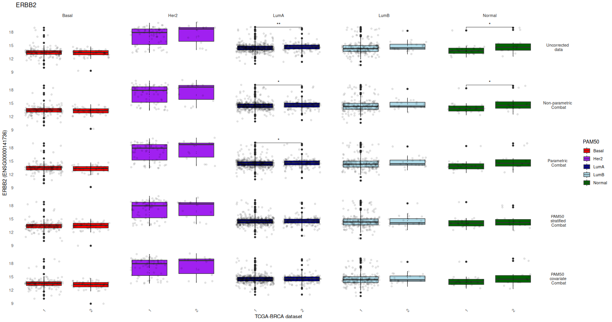

# The significance of molecular heterogeneity in breast cancer batch correction and dataset integration

Moir, N., et al (2025).

## Supplemental information

This repository supplements the manuscript submitted as a Brief Communication by Moir *et al*, 2025. The aim herein is to provide further methodological detail to allow independent reproduction of results presented within the submission. 

## Overview
 

*Figure A. Overview of manuscript workflow.*

The effect of four different ComBat batch correction approaches were evaluated on breast cancer gene expression data. Parametric and non-parametric implementations are configured using the ComBat par.prior=TRUE or par.prior=FALSE flags. ComBat was also evaluated when incorporating sample PAM50 sample assignments into the underlying linear model, using the mod flag of the [ComBat](https://bioconductor.org/packages/release/bioc/manuals/sva/man/sva.pdf) function to include a model matrix containing PAM50 subtype classes.

A further PAM50 stratified batch correction approach was evaluated, where each of the PAM50 molecular subtype sample classifications were corrected together. With this approach, samples belonging to each of the 5 PAM50 sample classifications are corrected alongside samples of the same PAM50 grouping. For example, the 331 METABRIC Basal samples (118 from Discovery and 213 from Validation datasets) were batch corrected together, separate from other PAM50 classes. This approach was implemented for all 5 PAM50 classes in turn.


## Data
This brief communication leverages the following three distinct datasets:
### METABRIC
METABRIC consortium data was first described by [Curtis et al. 2012](https://www.nature.com/articles/nature10983) and later by [Pereira et al. 2016](https://www.nature.com/articles/ncomms11479).  Expression data is available following authorisation by the METABRIC data access committee of the European Genome Archive. Primary EGAF00000102986/ discovery (n = 997) and EGAF00000102987/validation (n = 989) log2 quantile normalised validation and discovery expression datasets were downloaded using the EGA python client version 3.4.1. Corresponding METABRIC sample clinical data, including PAM50 molecular subtype assignment, is contained within supplementary files provided by [Curtis et al. 2012](https://static-content.springer.com/esm/art%3A10.1038%2Fnature10983/MediaObjects/41586_2012_BFnature10983_MOESM266_ESM.zip).

### TCGA BRCA

TCGA-BRCA mRNA counts were obtained using tcgabiolinks. The data was transformed using a variance-stabilising transformation prior to correction, allowing a direct comparison using standard ComBat. Batch effects, resulting from different flow-cell processing of the samples, has been reported by [Molania et al. 2023](https://www.nature.com/articles/s41587-022-01440-w). Samples were processed between 2010 and 2014, with 2010/2011 samples using different processing pipeline than 2012/2013/2014 samples.

| Batch | Year   | Samples (n) | 
|-------|:--------:|:-----:|
| 1 | 2010 | 361 |
| 1 | 2011 | 591 |
| 2 | 2012 | 82 |
| 2 | 2013 | 120 |
| 2 | 2014 | 42 |

*Table A. Batches in TCGA-BRCA dataset were assigned corresponing to sample processing date*


### GSE6532
Breast cancer gene expression dataset GSE6532 is freely available from https://www.ncbi.nlm.nih.gov/geo/query/acc.cgi?acc=GSE6532 and was obtained using the getGEO function of the R [GEOquery](https://bioconductor.org/packages/release/bioc/html/GEOquery.html) package:

```
library(GEOquery)
GSE5532full <- getGEO("GSE6532",getGPL = TRUE)
```

The .cel file header information of the #327 U133A chips in GSE6532 show that samples were processed between 2003-04-22 and 2004-09-02. Dimension reduction of expression data using UMAP (figure B) clearly identifies a potential time-dependent batch effect. Samples group into 3 batches, with each batch containing 149, 69, and 109 samples. 



*Figure B. UMAP projection of GSE6532 U133A expression.*


Group 1 (149 samples) contains samples processed between  2003-04-22 and 2003-07-04. Group 2 (69 samples) were processed between 2003-08-01 and 2003-09-23, with group 3 (109 samples) having .cel dates between 2004-07-28 and 2004-09-02.

| Group         | Samples (n) | .cel file date range|
|--------------|:-----:|-----------:|
| 1 | 149 | 2003-04-22 to 2003-07-04 |
| 2 |  69 | 2003-08-01 to 2003-09-23 |
| 3 | 109 | 2004-07-28 to 2004-09-02 |

*Table B. Batches identified in dataset GSE6532 correlate with analysis date contained with source .cel files*


## Molecular subtype distribution
METABRIC PAM50 molecular subtype classifications were obtained from the original Nature publication. From the supplementary files, these sample assignments were assigned collectively to samples within each of the 2 released datasets. Batch effects were therefore avoided with this classification.

| Batch      | Basal | Luminal A | Luminal B | Her2 | Normal |
|--------------|:-----:|:-----------:|:---------:|:----------:|--------:|
| Discovery | 118 | 466 | 268 | 87 | 58 | 
| Validation | 213 | 255 | 224 | 153 | 144 | 

*Table C. METABRIC PAM50 molecular subtype classifications*


PAM50 classification of samples within the GSE6532 dataset were conducted using molecular.subtyping function of the R [AIMS](https://bioconductor.org/packages/release/bioc/html/AIMS.html) library. Sample assigments were designated using the whole dataset and assignments confirmed by re-running the classification individually for each batch of samples.  

| Batch      | Basal | Luminal A | Luminal B | Her2 | Normal |
|--------------|:-----:|:-----------:|:---------:|:----------:|--------:|
| 1 | 11 | 15 | 11 | 9 | 23 | 
| 2 | 17 | 27 | 24 | 25| 56 | 
| 3 | 0  | 30 | 43 | 15| 21 | 

*Table D. GSE6532 PAM50 molecular subtype classifications*


TCGA PAM50 molecular subtype clasifications from the original 2012 [Nature] (https://doi.org/10.1038/nature11412) article. 

| Batch      | Basal | Luminal A | Luminal B | Her2 | Normal |
|--------------|:-----:|:-----------:|:---------:|:----------:|--------:|
| 1 | 137 | 414 | 185 | 67 | 24 | 
| 2 | 48 | 138 | 21 | 14 | 14 | 
 
*Table E. TCGA-BRCA PAM50 molecular subtype classifications*


## Visualisation of biomarker expression augmentation

Effective batch correction removes technical effects but retains vital biological signal. Evaluation of ESR1, ERBB2 and AURKA expression is used to visualise batch correction effects. While the main manuscript submission includes only results where there are statistically significant differences within PAM50 subtypes, there is full inclusion of not significant results here.


### METABRIC

METABRIC probes ILMN_1678535 (ESR1), ILMN_2352131 (ERBB2) and ILMN_1680955 (AURKA) are used to evaluate batch correction approaches.  Effectiveness of batch correction can be evaluated by comparing post-correction biomarker expression within each PAM50 class. It is reasonable to expect that within each PAM50 subtype, following precise batch correction and removal of technical effects, biomarker expression between batches should be very similar.  


*Figure C. METABRIC post-correction expression of ESR1 within PAM50 subtypes and between batches.*


*Figure D. METABRIC post-correction expression of ERBB2 within PAM50 subtypes and between batches.*


*Figure E. METABRIC Post-correction expression of AURKA within PAM50 subtypes and between batches.*

As seen in Figures C,D and E (above), there is noticeable variation in METABRIC biomarker expression between batch correction implementations.  Both approaches that account for molecular heterogenity (PAM50 stratified and PAM50 covariate) appear to be much more effective than standard Combat at removing technical differences while preserving biological fidelity. On balance, the above analysis of biomarker ESR1, ERBB2 and AURKA expression perhaps suggest that a PAM50 stratified approach may be most effective.  


<!----->

### GSE6532

GSE6532 probes 205225_at (ESR1), 216836_s_at (ERBB2) and 204092_s_at (AURKA) are used to evaluate batch correction approaches.


*Figure F. GSE6532 post-correction expression of ESR1 within PAM50 subtypes and between batches.*


*Figure G. GSE6532 post-correction expression of ERBB2 within PAM50 subtypes and between batches.*


*Figure H. GSE6532 post-correction expression of AURKA within PAM50 subtypes and between batches.*

Analysis of dataset GSE6532 shows that ESR1 expression ican be adversely affected by ComBat batch correction.  We see in figures F,G and H (above) that statistically significant differences between batches within PAM50 subtypes are fewer within this dataset. With ESR1 expression however,  PAM50 stratifed ComBat appears to perform most effectively at removing technical differences while retaining biological signal.

### TCGA-BRCA

Transcripts ENSG00000091831 (ESR1), ENSG00000087586 (AURKA) and ENSG00000141736 (ERBB2) are used to evaluate batch correction expression augmentation.


*Figure I. TCGA-BRCA post-correction expression of ESR1 within PAM50 subtypes and between batches.*


*Figure J. TCGA-BRCA post-correction expression of ERBB2 within PAM50 subtypes and between batches.*


*Figure K. TCGA-BRCA post-correction expression of AURKA within PAM50 subtypes and between batches.*

Both AURKA and ESR1 plots show evidence of parametric, non-parametric and covariate ComBat introducing significant expression differences between sample batches. Analysis of TCGA-BRCA correction also indicates the superiority of PAM50-driven correction approaches at removing technical batch effects. 

